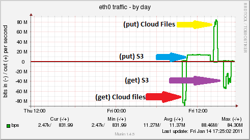

+++
title = "A quick (and quite unscientific!) break down of Rackspace CloudFiles UK vs Amazon S3 (Ireland)"
#description = ""
date = "2011-01-16T16:06:14+00:00"
#updated = ""
#slug = ""
weight = 0
draft = false
#path = 
aliases = [
    "/?p=152",
    "/2011/01/16/a-quick-and-quite-unscientific-break-down-of-rackspace-cloudfiles-uk-vs-amazon-s3-ireland/"
]
in_search_index = true


tags = [
    "cloud", "s3", "swift",    "Linux",
    "Projects",
    "Software"
]
[extra]
+++

(Disclaimer – I’m a Rackspace Employee, the postings on this site are my own, may be bias, and don’t necessarily represent Rackspace’s positions, strategies or opinions. These tests have been preformed independently from my employer by my self)

As Rackspace have recently launched a ‘beta’ Cloudfiles service within the UK I thought I would run a few tests to compare it to Amazon’s S3 service running from Eire (or Southern Ireland).

I took a set of files, totalling 18.7GB, with file sizes ranging from between 1kb and 25MB, text files, and contents being mainly Photos (both JPEG and RAW (cannon and nikon), plain text files, GZiped Tarballs and a few Microsoft Word documents just for good measure.

The following python scripts were used:

# Cloud Files
Upload

```python

import cloudfiles
import sys,os

api_username="USERNAME"
api_key="KEY"
auth_url="https://lon.auth.api.rackspacecloud.com/v1.0"
dest_container="CONTAINER"
local_file_list = sys.stdin.readlines()
cf = cloudfiles.get_connection(api_username, api_key, authurl=auth_url)
containers = cf.get_all_containers()
for container in containers:
    if container.name == dest_container:
            backup_container = container

def upload_cf(local_file):
    u = backup_container.create_object(local_file)
    u.load_from_filename(local_file)

for local_file in local_file_list:
        local_file = local_file.rstrip()
        local_file_size = os.stat(local_file).st_size/1024
        print "uploading %s (%dK)" % (local_file, local_file_size)
        upload_cf(local_file)
```

Download

```python

api_username="USERNAME"
api_key="KEY"
auth_url="https://lon.auth.api.rackspacecloud.com/v1.0"
dest_container="CONTAINER"


import cloudfiles
import sys,os

#Setup the connection
cf = cloudfiles.get_connection(api_username, api_key, authurl=auth_url)

#Get a list of containers
containers = cf.get_all_containers()

# Lets setup the container
for container in containers:
    if container.name == dest_container:
            backup_container = container

#Create the container if it does not exsit
try:
    backup_container
except NameError:
    backup_container = cf.create_container(dest_container)

# We've now got our container, lets get a file list
def build_remote_file_list(container):
    remote_file_list = container.list_objects_info()
    for remote_file in remote_file_list:
        f = open(remote_file['name'],'w')
        rf = container.get_object(remote_file['name'])
        print remote_file['name']
        for chunk in rf.stream():
            f.write(chunk)
        f.close()
remote_file_list = build_remote_file_list(backup_container)
```

# s3
Upload

```python

from boto.s3.connection import S3Connection
from boto.s3.key import Key
import sys,os

dest_container = "CONTAINER"

s3 = S3Connection('api','api_secret')

buckets = s3.get_all_buckets()

for container in buckets:
    if container.name == dest_container:
                backup_container = container

def build_remote_file_list(container):
    remote_file_list = container.list()
    for remote_file in remote_file_list:
        print remote_file
        f = open(remote_file,'w')
        rf = container.get_key(remote_file)
        #print remote_file['name'
        rf.get_file(f)
        f.close()

local_file_list = sys.stdin.readlines()

def upload_s3(local_file):
    k = Key(backup_container)
    k.key = local_file
    k.set_contents_from_filename(local_file)

for local_file in local_file_list:
        local_file = local_file.rstrip()
        local_file_size = os.stat(local_file).st_size/1024
        print "uploading %s (%dK)" % (local_file, local_file_size)
        upload_s3(local_file)
```

Download

```python

from boto.s3.connection import S3Connection
from boto.s3.key import Key
import sys,os

dest_container = "CONTAINER"

s3 = S3Connection('api','apt_secret')

buckets = s3.get_all_buckets()

for container in buckets:
    if container.name == dest_container:
                backup_container = container

def build_remote_file_list(container):
    remote_file_list = container.list()
    for remote_file in remote_file_list:
        print remote_file.name
        f = open(remote_file.name,'w')
        rf = container.get_key(remote_file.name)
        #print remote_file['name'
        rf.get_file(f)
        f.close()


remote_file_list = build_remote_file_list(backup_container)

```

The test was preformed from a Linux host which has a 100MBit connection (Uncapped/unthrottled) in London, however the test was also preformed with almost identical results from a machine in Paris (also 100mbit). Tests were also run from other locations (Dallas Fort Worth – Texas, my home ISP (bethere.co.uk)) however these locations were limited to 25mbit and 24mbit , and both reached their maximum speeds.

The tests were as follows:

1. Download files from Rackspace Cloudfiles UK (these had been uploaded previously) – This is downloaded directly via the API, NOT via a CDN
2. Upload the same files to S3 Ireland
3. Upload the same files to a new “container” at Rackspace Cloudfiles UK
4. Download the files from S3 Ireland – This is downloaded directly via the API, NOT via a CDN

The average speeds for the tests are as follows:  

# Cloudfiles
Download: 90Mbit/s  
Upload: 85MBit/s  

# S3 Ireland  
Download: ~40Mbit/s  
Upload : 13Mbit/s

Observations

1. Cloud files seems to be able to max out a 100mbit connection for both File
2. S3 seems to have a cap of 13mbit for inbound file transfers?
3. S3 seems to either be extremely unpredictable on file transfer speeds for downloading files via the API, or there is some form of cap after a certain amount of data transferred, or there was congestion on the AWS network
Below is a graph showing the different connection speeds achieved using CF & S3  


As mentioned before this is a very unscientific test (and I’d say that these results have not been replicated from as many locations or as many times as I’d like to, so I would take them with a pinch of salt) , but it does appear that Rackspace cloudfiles UK is noticeably faster than S3 Ireland