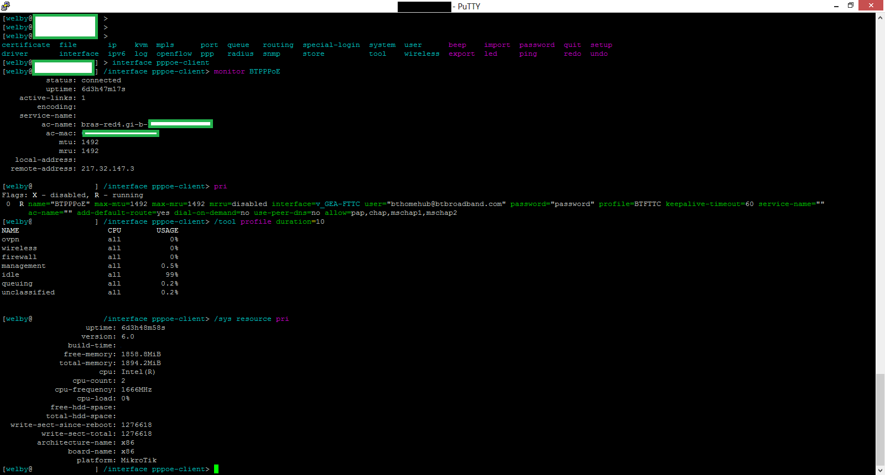
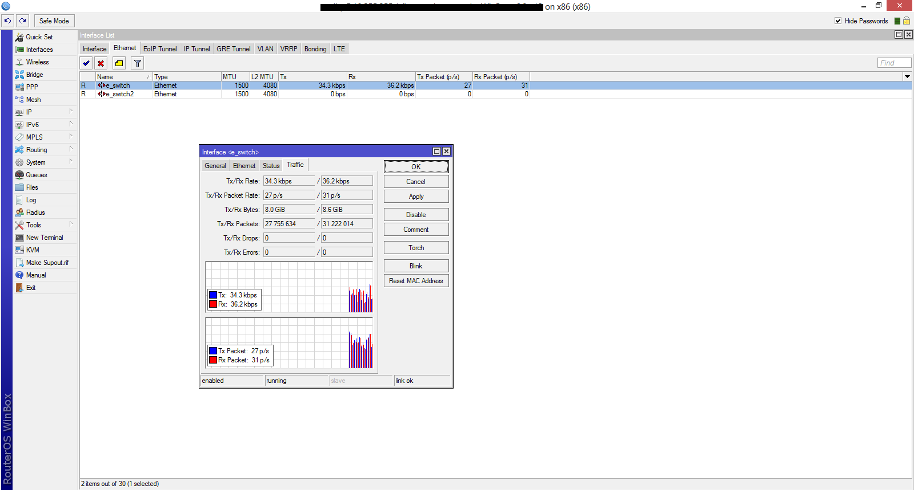

+++
title = "RouterBoard as a Home Router – 4 1/2 years on"
#description = ""
date = "2013-07-13T22:23:05+01:00"
#updated = ""
#slug = "a-brief-overview-of-openhab"
weight = 0
draft = false
#path = 
aliases = [
    "/?p=293",
    "/2013/07/13/routerboard-as-a-home-router-4-12-years-on/"
]
in_search_index = true

tags = [
    "Hardware",
    "Infrastructure",
    "Mikrotik",
    "Networking"
]
[extra]
+++

A while back I mentioned a follow up to an [old blog post]() about the RouterBoard that i’d recently purchased and setup for home use. This is a very belated update on that board.

My requirements have since changed from the original post, but not dramatically so. The requirement for LACP has disapeared, IPSec is no longer used, but a requirement for Dynamic Routing has appeared.

All in all, I have to say that I still cannot recommend RouterOS enough. I’ve been using it the past 4 1/2 years, and have recommended a large number of folks to use it.

The main reason behind this is that it just works, there’s not really any faffing about that needs to be done, and if you’re running the stable release, everything does just work.

Feature wise, this is right up there with some of the big brands (Cisco, Juniper et all), however its fair to say not with the same price tag.

# Hardware

For now I’m going to concentrate on the hardware side of things. When I originally wrote the post there was no requirement for GigE, however this has changed since. I also was using a 24MBit/2.5MBit DSL connection, which has changed now to a 80/20, significantly increasing the bandwidth requirements just from a ISP point of view. With this in mind my RB433 was not going to continue to cut the mustard. This being said, it is still there as my Backup Router, and is able to cope with the Internet side of things during a failover situation. My Primary router is an old(ish) CoreDuo-Mobile MiniITX x86 Board that I had spare. I’m using this now simply as I have a large number of VLans in use, that need to be doing high (1GBit) amounts of throughput between each other, whilst still having ACLs applied. Its worth while noting that with the same levels of inspection going on (Layer 3/Layer 4) this X86 RouterOS machine is able to out preform the medium-high end Cisco ASA-5550 firewall. On a per interface basis there is an average of 80 Rules, and yet it’s still able to cope with 1GBit per interface. There are 3 GigE Interfaces on this device, and I’ve seen upwards of 2.6GBit/s throughput, with CPU being Software

In terms of software. Where to start. RouterOS is superb, there are very few faults from my point of view. If I look at the most important features (from my prespective at least):

# CLI

RouterOS has a wonderful CLI. Whilst its not a cisco interface, its not trying to be, which means you can at least let it off for any discrepancies. In terms of access to the CLI it’s avaiable over SSH (prefered!), Telnet, MAC-Telnet (uses a non standard Protocol, IE not IP, IPX etc) or of course trusty Serial.  


# GUI

RouterOS has the “WinBox” and “WebBox” gui’s. I’ve got to admit, I’ve never used WebBox, however WinBox is a nice front end to the router.  


# Firewall Rules

Whilst I’ve had one of the people I’ve recommend this to disagree with me on this, I stick by my comparison. Mikrotik Firewall rules are just IPTables. There’s nothing major changed from a generic Linux machines IPTables and the Mikrotik side of things, at least from a management perspective. Creating the rules however, does not require you to memorise the IPTables commandline flags, as mikrotik’s cli/winbox has a different way of doing it. In terms of rule sets, I like to have lots of jumps in my rules, whilst it may not be quite as efficent, it makes it easier (IMO) to manage rules. I’m going to include a very simple firewall rule set (this is NOT what I use)

```
/ip firewall filter
add action=jump chain=input jump-target=ppp
add action=jump chain=forward jump-target=ppp
add action=jump chain=BTPPPOE_IN comment="Jump to Common Input rules" jump-target=input_common
add action=drop chain=BTPPPOE_IN comment="Drop the BT Vision stuff" dst-address=224.0.0.0/24 protocol=igmp
add chain=BTPPPOE_IN comment="SSH to Bastion (NAT)" connection-state=new dst-address=192.168.0.2 dst-port=22 protocol=tcp
add action=jump chain=BTPPPOE_IN comment="Jump to Drop_and_log" jump-target=DROP_AND_LOG
add chain=input_common comment="Accept established connections" connection-state=established
add chain=input_common comment="Accept related connections" connection-state=related
add action=log chain=input_common comment="Drop invalid connections" connection-state=invalid log-prefix=INVALID
add action=drop chain=input_common comment="Drop invalid connections" connection-state=invalid
add chain=input_common comment="SHHENNNDDD ONE PING ONLY" icmp-options=8 limit=1/1m,0 protocol=icmp
add action=drop chain=input_common comment="SHHENNNDDD ONE PING ONLY" icmp-options=8 protocol=icmp
add action=log chain=DROP_AND_LOG comment="Log everything else"
add action=drop chain=DROP_AND_LOG comment="Drop everything else"

/ip firewall nat
add action=jump chain=srcnat comment="Jumpt to SourceNats" jump-target=SourceNats
add action=masquerade chain=SourceNats comment="Masquerade everything leaving on the BTPPPoE Interface" out-interface=BTPPPoE
add action=jump chain=dstnat comment="Jumpt to Portforwards" jump-target=PortForwards
add action=dst-nat chain=PortForwards comment="SSHd on BTPPPoE to Bastion" dst-port=22 in-interface=BTPPPoE protocol=tcp to-addresses=192.168.0.2
```

A quick glance over this should give you a quick view of what the rule set does, with potentially the only pitfall being the PPP Jump, this will jump into the ppp chain that is created for any PPP interface.

# Crazy Firewall Rules
Layer 7 inspection is a difficult beast. Whilst RouterOS does **NO** L7 inspection out of the box (other than some ALGs), it is possible to make your own Layer 7 rules. For example, I want any reverse dns lookup for a specific IP block to be sent to a certain DNS server, irregardless of what DNS server is setup I could do the following 

```
/ip firewall layer7-protocol
add name=DNSL7 regexp=1.1.in-addr.arpa
/ip firewall mangle
add action=mark-connection chain=prerouting disabled=yes dst-port=53 layer7-protocol=DNSL7 new-connection-mark=forwarded-dns protocol=udp
add action=mark-connection chain=prerouting disabled=yes dst-port=53 layer7-protocol=DNSL7 new-connection-mark=forwarded-dns protocol=tcp

/ip firewall nat
add action=dst-nat chain=dstnat comment="Reverse DNS to SERVERXYZ" connection-mark=forwarded-dns to-addresses=1.1.1.2
```

This would forward any request for reverse DNS for 1.1.x.x to 1.1.1.2.

# Wireless

RouterOS supports 802.11abgn, on 2.4/5GHz depending on the protocol! Security wise, you can have per device WPA2 psks, or use various WPA2 Enterprise authentication methods via Radius

# VPNs

Originally I was using IPSec VPNs everywhere. Whilst IPSec is still my preferred option, it is a little bit of a pain to work with if you have a dynamic IP address, as I do. I’ve moved to using OpenVPN for most Site To Site vpns. RouterOS doesnt support UDP for OpenVPN unfortunately, however this isnt a major issue.

# Dynamic Routing

RIP, RIPNG, OSPF, BGP, HMWP. Chose one! RouterOS supports all. I’m running a VPN between about 10 other peers at the moment, and we’re using BGP to exchange routes between each other. It just works. Some remote peers are Quagga, some Cisco, some RouterOS, all seem to work rather fine.

All in all, I’d recommend RouterOS and the RouterBoard hardware!